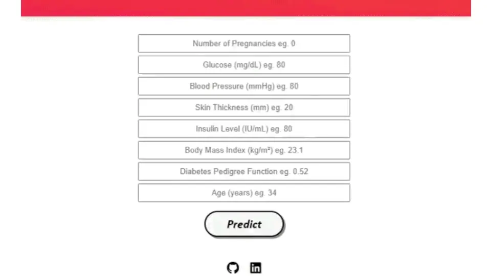

# Loan Approval Prediction - Deployment
  

• This repository consists of files required to deploy a ___Machine Learning Web App___ created with ___Flask___ on ___Vercel___.

• If you want to view the deployed model, click on the following link: 
Deployed at: _https://loan-approval-prediction.vercel.app/_

• A glimpse of the web app:

